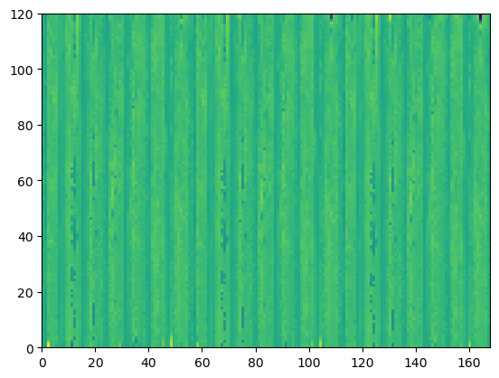

```python
%load_ext autoreload
%autoreload 2

# hardware
import os
# analysis
import numpy as np
import xarray as xr
import pandas as pd
from scipy.integrate import simps
from scipy.interpolate import RegularGridInterpolator
# vis
import matplotlib.pyplot as plt
plt.style.use('seaborn-v0_8-deep')

# Acoustic tomography package
import atom
# configuration object
from hydra import initialize, compose
from hydra.utils import instantiate
with initialize(version_base=None, config_path="../../conf/"):
    cfg = compose(config_name="configs",)
```

# Time-Dependent Stochastic Inversion
In the end, the mapping between observed acoustic travel times and fluctuating temperature and velocity fields is a simple linear system.


```python
## Array data
atarray = instantiate(cfg.atarray)
atarray.setupPathIntegrals()

## Constants
constants = instantiate(cfg.constants)

# ModelGrid object
mg = atom.fluctuatingField.ModelGrid(
    nModelPointsX=51, 
    nModelPointsY=51, 
    modelLimsX=np.array([-50,50]), 
    modelLimsY=np.array([-50,50])
)
mg.buildModelGrid()

## Bulk flow linear system
### instatiate from saved data
ls = atom.backgroundFlow.LinearSystem.from_netcdf('../bulkField_example_data.nc')
cm = atom.fluctuatingField.CovarianceMatrices.from_pickle('../covarianceMatrices_nF=2_example.pk')
```


```python
tdsi = atom.fluctuatingField.TimeDependentStochasticInversion(
    modelGrid=mg.ds, 
    atarray=atarray.ds, 
    covarMatrices=cm.ds,
    bulkFlowData=ls.ds,
    stencil=cm.stencil,
    frameSets=cm.frameSets
)

tdsi.optimalStochasticInverseOperator()
tdsi.assembleDataVector()
tdsi.calculateFluctuatingFields()
```


```python
plt.pcolor(tdsi.ds.dataVector.values)
plt.xlabel('Path ID
```


    <matplotlib.collections.PolyCollection at 0x7ff042464340>


    

    

