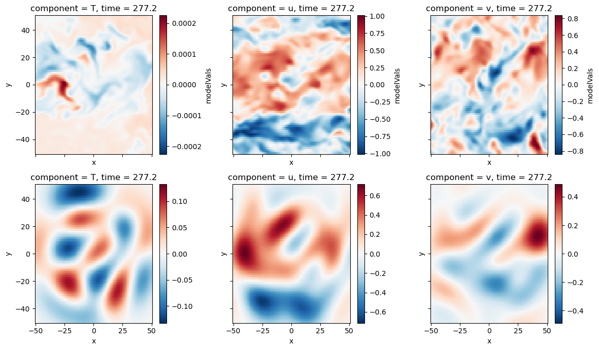

```python
%load_ext autoreload
%autoreload 2

# hardware
import os
# analysis
import numpy as np
import xarray as xr
import pandas as pd
from scipy.integrate import simps
from scipy.interpolate import RegularGridInterpolator
# vis
import matplotlib.pyplot as plt
plt.style.use('seaborn-v0_8-deep')

# Acoustic tomography package
import atom
# configuration object
from hydra import initialize, compose
from hydra.utils import instantiate
with initialize(version_base=None, config_path="../../conf/"):
    cfg = compose(config_name="configs",)
```

    The autoreload extension is already loaded. To reload it, use:
      %reload_ext autoreload


# Virtual Acoustic Tomography Array
One of the best ways for us to explore capabilities and limitations of the method is by creating a virual acoustic tomography array within a series of large-eddy simulations (LES). 
The virtual array comes with the unbelievable benefit of having a set of "ground truth" velocity and temperature fields that we can use as a basis for comparison of the AT retrievals.

This notebook goes through the workflow for loading LES data from an offline simulation and developing AT estimates of the flow fields.


```python
### Array data
atarray = instantiate(cfg.atarray)
atarray.setupPathIntegrals()
constants = instantiate(cfg.constants)
```


```python
# load LES data, estimate travel times
datapath = '/Users/nhamilt2/Documents/ATom/data/AT_array_sampling_z=9.5_6.66667Hz.nc'
les = atom.simulation.LESData(loadPath=datapath, atarray=atarray.ds, constants=constants)
les.calculate_travel_time()

# calculate fluctuating velocities
TFluc = les.ds.T - les.ds.TBulk
uFluc = les.ds.u - les.ds.uBulk
vFluc = les.ds.v - les.ds.vBulk

#downsample to match model grid
lesVals = xr.concat([TFluc, uFluc, vFluc], dim='component')
lesVals['component'] = ['T','u','v']
# lesVals = lesVals.sel(x=mg.ds.unstack().x, y=mg.ds.unstack().y, method='nearest')
lesVals = lesVals.stack(modelVar=['component','x','y'])
lesVals.name='modelVals'

Tfluc = lesVals.sel(component='T').unstack()
ufluc = lesVals.sel(component='u').unstack()
vfluc = lesVals.sel(component='v').unstack()

ls = atom.backgroundFlow.linearsystem.LinearSystem(
    atarray=atarray.ds,
    measuredTravelTime=les.ds.travelTimes.rename({'time':'frame'}),
    constants=constants
)
ls.executeProcess()
```

## Build the model grid
This is the domain where the fluctuating fields of temperature and velocity are reconstructed. In this case, we are describing a grid that matches the LES sample domain exactly so that there is no need for interpolation or downsampling when comparing field estimates.


```python
#Build model grid
mg = atom.fluctuatingField.ModelGrid(
    nModelPointsX=len(lesVals.unstack().x), 
    nModelPointsY=len(lesVals.unstack().y), 
    modelLimsX=np.array([lesVals.x.values.min(), lesVals.x.values.max()]), 
    modelLimsY=np.array([lesVals.y.values.min(), lesVals.y.values.max()])
)
mg.buildModelGrid()
```


```python
# Covariance Matrix object
cfg.covariancematrix['nFrames'] = 4

# cm = atom.fluctuatingField.CovarianceMatrices(
#     cfg.covariancematrix,
#     mg.getDataset(), 
#     atarray.ds,
#     ls.ds,
# )
# cm.assembleTDSICovarianceMatrices()
# cm.to_pickle(f'../covarianceMatrices_nF={cfg.covariancematrix.nFrames}_example.pk')

cm = atom.fluctuatingField.CovarianceMatrices.from_pickle(f'../covarianceMatrices_nF={cfg.covariancematrix.nFrames}_example.pk')
```


```python
tdsi = atom.fluctuatingField.TimeDependentStochasticInversion(
    modelGrid=mg.ds, 
    atarray=atarray.ds, 
    covarMatrices=cm.ds,
    bulkFlowData=ls.ds,
    stencil=cm.stencil,
    frameSets=cm.frameSets
)

tdsi.optimalStochasticInverseOperator()
tdsi.assembleDataVector()
tdsi.calculateFluctuatingFields()
```

## Optimal data vector
Our work so far indicates that interpolating and integrating fields along travel paths still produces some numerical error that interferes with the retrieval of fluctuating fields. To remove this numerical error, we calculate the optimal data vector $\hat{\mathbf{d}}$ by mapping the LES data $\mathbf{m}$ to the data space through the optimal stochastic inverse operator $\mathbf{A}$. 

$$\hat{\mathbf{d}} = (\mathbf{A}^\intercal \mathbf{A})^{-1}(\mathbf{A}^\intercal \mathbf{m})$$

The optimal data vector is then used as a direct replacement for the original, measured data vector to produce the optimal retrieval with the TDSI method.

$$\hat{\mathbf{m}} = \mathbf{A}\hat{\mathbf{d}}$$


```python
tdsi.ds
```


<div><svg style="position: absolute; width: 0; height: 0; overflow: hidden">
<defs>
<symbol id="icon-database" viewBox="0 0 32 32">
<path d="M16 0c-8.837 0-16 2.239-16 5v4c0 2.761 7.163 5 16 5s16-2.239 16-5v-4c0-2.761-7.163-5-16-5z"></path>
<path d="M16 17c-8.837 0-16-2.239-16-5v6c0 2.761 7.163 5 16 5s16-2.239 16-5v-6c0 2.761-7.163 5-16 5z"></path>
<path d="M16 26c-8.837 0-16-2.239-16-5v6c0 2.761 7.163 5 16 5s16-2.239 16-5v-6c0 2.761-7.163 5-16 5z"></path>
</symbol>
<symbol id="icon-file-text2" viewBox="0 0 32 32">
<path d="M28.681 7.159c-0.694-0.947-1.662-2.053-2.724-3.116s-2.169-2.030-3.116-2.724c-1.612-1.182-2.393-1.319-2.841-1.319h-15.5c-1.378 0-2.5 1.121-2.5 2.5v27c0 1.378 1.122 2.5 2.5 2.5h23c1.378 0 2.5-1.122 2.5-2.5v-19.5c0-0.448-0.137-1.23-1.319-2.841zM24.543 5.457c0.959 0.959 1.712 1.825 2.268 2.543h-4.811v-4.811c0.718 0.556 1.584 1.309 2.543 2.268zM28 29.5c0 0.271-0.229 0.5-0.5 0.5h-23c-0.271 0-0.5-0.229-0.5-0.5v-27c0-0.271 0.229-0.5 0.5-0.5 0 0 15.499-0 15.5 0v7c0 0.552 0.448 1 1 1h7v19.5z"></path>
<path d="M23 26h-14c-0.552 0-1-0.448-1-1s0.448-1 1-1h14c0.552 0 1 0.448 1 1s-0.448 1-1 1z"></path>
<path d="M23 22h-14c-0.552 0-1-0.448-1-1s0.448-1 1-1h14c0.552 0 1 0.448 1 1s-0.448 1-1 1z"></path>
<path d="M23 18h-14c-0.552 0-1-0.448-1-1s0.448-1 1-1h14c0.552 0 1 0.448 1 1s-0.448 1-1 1z"></path>
</symbol>
</defs>
</svg>
<style>/* CSS stylesheet for displaying xarray objects in jupyterlab.
 *
 */

:root {
  --xr-font-color0: var(--jp-content-font-color0, rgba(0, 0, 0, 1));
  --xr-font-color2: var(--jp-content-font-color2, rgba(0, 0, 0, 0.54));
  --xr-font-color3: var(--jp-content-font-color3, rgba(0, 0, 0, 0.38));
  --xr-border-color: var(--jp-border-color2, #e0e0e0);
  --xr-disabled-color: var(--jp-layout-color3, #bdbdbd);
  --xr-background-color: var(--jp-layout-color0, white);
  --xr-background-color-row-even: var(--jp-layout-color1, white);
  --xr-background-color-row-odd: var(--jp-layout-color2, #eeeeee);
}

html[theme=dark],
body[data-theme=dark],
body.vscode-dark {
  --xr-font-color0: rgba(255, 255, 255, 1);
  --xr-font-color2: rgba(255, 255, 255, 0.54);
  --xr-font-color3: rgba(255, 255, 255, 0.38);
  --xr-border-color: #1F1F1F;
  --xr-disabled-color: #515151;
  --xr-background-color: #111111;
  --xr-background-color-row-even: #111111;
  --xr-background-color-row-odd: #313131;
}

.xr-wrap {
  display: block !important;
  min-width: 300px;
  max-width: 700px;
}

.xr-text-repr-fallback {
  /* fallback to plain text repr when CSS is not injected (untrusted notebook) */
  display: none;
}

.xr-header {
  padding-top: 6px;
  padding-bottom: 6px;
  margin-bottom: 4px;
  border-bottom: solid 1px var(--xr-border-color);
}

.xr-header > div,
.xr-header > ul {
  display: inline;
  margin-top: 0;
  margin-bottom: 0;
}

.xr-obj-type,
.xr-array-name {
  margin-left: 2px;
  margin-right: 10px;
}

.xr-obj-type {
  color: var(--xr-font-color2);
}

.xr-sections {
  padding-left: 0 !important;
  display: grid;
  grid-template-columns: 150px auto auto 1fr 20px 20px;
}

.xr-section-item {
  display: contents;
}

.xr-section-item input {
  display: none;
}

.xr-section-item input + label {
  color: var(--xr-disabled-color);
}

.xr-section-item input:enabled + label {
  cursor: pointer;
  color: var(--xr-font-color2);
}

.xr-section-item input:enabled + label:hover {
  color: var(--xr-font-color0);
}

.xr-section-summary {
  grid-column: 1;
  color: var(--xr-font-color2);
  font-weight: 500;
}

.xr-section-summary > span {
  display: inline-block;
  padding-left: 0.5em;
}

.xr-section-summary-in:disabled + label {
  color: var(--xr-font-color2);
}

.xr-section-summary-in + label:before {
  display: inline-block;
  content: '►';
  font-size: 11px;
  width: 15px;
  text-align: center;
}

.xr-section-summary-in:disabled + label:before {
  color: var(--xr-disabled-color);
}

.xr-section-summary-in:checked + label:before {
  content: '▼';
}

.xr-section-summary-in:checked + label > span {
  display: none;
}

.xr-section-summary,
.xr-section-inline-details {
  padding-top: 4px;
  padding-bottom: 4px;
}

.xr-section-inline-details {
  grid-column: 2 / -1;
}

.xr-section-details {
  display: none;
  grid-column: 1 / -1;
  margin-bottom: 5px;
}

.xr-section-summary-in:checked ~ .xr-section-details {
  display: contents;
}

.xr-array-wrap {
  grid-column: 1 / -1;
  display: grid;
  grid-template-columns: 20px auto;
}

.xr-array-wrap > label {
  grid-column: 1;
  vertical-align: top;
}

.xr-preview {
  color: var(--xr-font-color3);
}

.xr-array-preview,
.xr-array-data {
  padding: 0 5px !important;
  grid-column: 2;
}

.xr-array-data,
.xr-array-in:checked ~ .xr-array-preview {
  display: none;
}

.xr-array-in:checked ~ .xr-array-data,
.xr-array-preview {
  display: inline-block;
}

.xr-dim-list {
  display: inline-block !important;
  list-style: none;
  padding: 0 !important;
  margin: 0;
}

.xr-dim-list li {
  display: inline-block;
  padding: 0;
  margin: 0;
}

.xr-dim-list:before {
  content: '(';
}

.xr-dim-list:after {
  content: ')';
}

.xr-dim-list li:not(:last-child):after {
  content: ',';
  padding-right: 5px;
}

.xr-has-index {
  font-weight: bold;
}

.xr-var-list,
.xr-var-item {
  display: contents;
}

.xr-var-item > div,
.xr-var-item label,
.xr-var-item > .xr-var-name span {
  background-color: var(--xr-background-color-row-even);
  margin-bottom: 0;
}

.xr-var-item > .xr-var-name:hover span {
  padding-right: 5px;
}

.xr-var-list > li:nth-child(odd) > div,
.xr-var-list > li:nth-child(odd) > label,
.xr-var-list > li:nth-child(odd) > .xr-var-name span {
  background-color: var(--xr-background-color-row-odd);
}

.xr-var-name {
  grid-column: 1;
}

.xr-var-dims {
  grid-column: 2;
}

.xr-var-dtype {
  grid-column: 3;
  text-align: right;
  color: var(--xr-font-color2);
}

.xr-var-preview {
  grid-column: 4;
}

.xr-index-preview {
  grid-column: 2 / 5;
  color: var(--xr-font-color2);
}

.xr-var-name,
.xr-var-dims,
.xr-var-dtype,
.xr-preview,
.xr-attrs dt {
  white-space: nowrap;
  overflow: hidden;
  text-overflow: ellipsis;
  padding-right: 10px;
}

.xr-var-name:hover,
.xr-var-dims:hover,
.xr-var-dtype:hover,
.xr-attrs dt:hover {
  overflow: visible;
  width: auto;
  z-index: 1;
}

.xr-var-attrs,
.xr-var-data,
.xr-index-data {
  display: none;
  background-color: var(--xr-background-color) !important;
  padding-bottom: 5px !important;
}

.xr-var-attrs-in:checked ~ .xr-var-attrs,
.xr-var-data-in:checked ~ .xr-var-data,
.xr-index-data-in:checked ~ .xr-index-data {
  display: block;
}

.xr-var-data > table {
  float: right;
}

.xr-var-name span,
.xr-var-data,
.xr-index-name div,
.xr-index-data,
.xr-attrs {
  padding-left: 25px !important;
}

.xr-attrs,
.xr-var-attrs,
.xr-var-data,
.xr-index-data {
  grid-column: 1 / -1;
}

dl.xr-attrs {
  padding: 0;
  margin: 0;
  display: grid;
  grid-template-columns: 125px auto;
}

.xr-attrs dt,
.xr-attrs dd {
  padding: 0;
  margin: 0;
  float: left;
  padding-right: 10px;
  width: auto;
}

.xr-attrs dt {
  font-weight: normal;
  grid-column: 1;
}

.xr-attrs dt:hover span {
  display: inline-block;
  background: var(--xr-background-color);
  padding-right: 10px;
}

.xr-attrs dd {
  grid-column: 2;
  white-space: pre-wrap;
  word-break: break-all;
}

.xr-icon-database,
.xr-icon-file-text2,
.xr-no-icon {
  display: inline-block;
  vertical-align: middle;
  width: 1em;
  height: 1.5em !important;
  stroke-width: 0;
  stroke: currentColor;
  fill: currentColor;
}
</style><pre class='xr-text-repr-fallback'>&lt;xarray.Dataset&gt;
Dimensions:                    (modelVar: 19683, pathID: 280, frame: 4002)
Coordinates:
  * modelVar                   (modelVar) object MultiIndex
  * component                  (modelVar) object &#x27;T&#x27; &#x27;T&#x27; &#x27;T&#x27; &#x27;T&#x27; ... &#x27;v&#x27; &#x27;v&#x27; &#x27;v&#x27;
  * modelXY                    (modelVar) object (-50.0, -50.0) ... (50.0, 50.0)
  * pathID                     (pathID) object MultiIndex
  * tdsiFrame                  (pathID) int64 -2 -2 -2 -2 -2 -2 ... 2 2 2 2 2 2
  * spk                        (pathID) int64 0 0 0 0 0 0 0 1 ... 7 7 7 7 7 7 7
  * mic                        (pathID) int64 1 2 3 4 5 6 7 0 ... 0 1 2 3 4 5 6
  * frame                      (frame) float64 0.0 0.15 0.3 ... 600.0 600.1
Data variables:
    stochasticInverseOperator  (modelVar, pathID) float64 -0.1048 ... 1.596
    dataVector                 (frame, pathID) float64 -17.74 -24.57 ... -4.48
    modelValues                (modelVar, frame) float64 -186.2 -186.2 ... 25.16</pre><div class='xr-wrap' style='display:none'><div class='xr-header'><div class='xr-obj-type'>xarray.Dataset</div></div><ul class='xr-sections'><li class='xr-section-item'><input id='section-2462cd52-8a1b-40c4-b061-c753324b95c4' class='xr-section-summary-in' type='checkbox' disabled ><label for='section-2462cd52-8a1b-40c4-b061-c753324b95c4' class='xr-section-summary'  title='Expand/collapse section'>Dimensions:</label><div class='xr-section-inline-details'><ul class='xr-dim-list'><li><span class='xr-has-index'>modelVar</span>: 19683</li><li><span class='xr-has-index'>pathID</span>: 280</li><li><span class='xr-has-index'>frame</span>: 4002</li></ul></div><div class='xr-section-details'></div></li><li class='xr-section-item'><input id='section-e3b07661-dc2d-4103-9281-522afb8cbf4b' class='xr-section-summary-in' type='checkbox'  checked><label for='section-e3b07661-dc2d-4103-9281-522afb8cbf4b' class='xr-section-summary' >Coordinates: <span>(8)</span></label><div class='xr-section-inline-details'></div><div class='xr-section-details'><ul class='xr-var-list'><li class='xr-var-item'><div class='xr-var-name'><span class='xr-has-index'>modelVar</span></div><div class='xr-var-dims'>(modelVar)</div><div class='xr-var-dtype'>object</div><div class='xr-var-preview xr-preview'>MultiIndex</div><input id='attrs-524244c7-5345-403e-b414-204aed589edc' class='xr-var-attrs-in' type='checkbox' disabled><label for='attrs-524244c7-5345-403e-b414-204aed589edc' title='Show/Hide attributes'><svg class='icon xr-icon-file-text2'><use xlink:href='#icon-file-text2'></use></svg></label><input id='data-ec12b2b4-576f-43d4-b2f8-5f8d438aabf9' class='xr-var-data-in' type='checkbox'><label for='data-ec12b2b4-576f-43d4-b2f8-5f8d438aabf9' title='Show/Hide data repr'><svg class='icon xr-icon-database'><use xlink:href='#icon-database'></use></svg></label><div class='xr-var-attrs'><dl class='xr-attrs'></dl></div><div class='xr-var-data'><pre>array([(&#x27;T&#x27;, (-50.0, -50.0)), (&#x27;T&#x27;, (-50.0, -48.75)), (&#x27;T&#x27;, (-50.0, -47.5)),
       ..., (&#x27;v&#x27;, (50.0, 47.5)), (&#x27;v&#x27;, (50.0, 48.75)), (&#x27;v&#x27;, (50.0, 50.0))],
      dtype=object)</pre></div></li><li class='xr-var-item'><div class='xr-var-name'><span class='xr-has-index'>component</span></div><div class='xr-var-dims'>(modelVar)</div><div class='xr-var-dtype'>object</div><div class='xr-var-preview xr-preview'>&#x27;T&#x27; &#x27;T&#x27; &#x27;T&#x27; &#x27;T&#x27; ... &#x27;v&#x27; &#x27;v&#x27; &#x27;v&#x27; &#x27;v&#x27;</div><input id='attrs-22e534f1-c1c6-4c35-ba42-8b604f4f3bee' class='xr-var-attrs-in' type='checkbox' disabled><label for='attrs-22e534f1-c1c6-4c35-ba42-8b604f4f3bee' title='Show/Hide attributes'><svg class='icon xr-icon-file-text2'><use xlink:href='#icon-file-text2'></use></svg></label><input id='data-12ac3107-00fa-4804-b502-4925f287eb12' class='xr-var-data-in' type='checkbox'><label for='data-12ac3107-00fa-4804-b502-4925f287eb12' title='Show/Hide data repr'><svg class='icon xr-icon-database'><use xlink:href='#icon-database'></use></svg></label><div class='xr-var-attrs'><dl class='xr-attrs'></dl></div><div class='xr-var-data'><pre>array([&#x27;T&#x27;, &#x27;T&#x27;, &#x27;T&#x27;, ..., &#x27;v&#x27;, &#x27;v&#x27;, &#x27;v&#x27;], dtype=object)</pre></div></li><li class='xr-var-item'><div class='xr-var-name'><span class='xr-has-index'>modelXY</span></div><div class='xr-var-dims'>(modelVar)</div><div class='xr-var-dtype'>object</div><div class='xr-var-preview xr-preview'>(-50.0, -50.0) ... (50.0, 50.0)</div><input id='attrs-0e9cc667-3a85-4d7f-87a8-24cf140dbfa1' class='xr-var-attrs-in' type='checkbox' disabled><label for='attrs-0e9cc667-3a85-4d7f-87a8-24cf140dbfa1' title='Show/Hide attributes'><svg class='icon xr-icon-file-text2'><use xlink:href='#icon-file-text2'></use></svg></label><input id='data-18bea66b-4a74-436e-8395-087f92b8ca31' class='xr-var-data-in' type='checkbox'><label for='data-18bea66b-4a74-436e-8395-087f92b8ca31' title='Show/Hide data repr'><svg class='icon xr-icon-database'><use xlink:href='#icon-database'></use></svg></label><div class='xr-var-attrs'><dl class='xr-attrs'></dl></div><div class='xr-var-data'><pre>array([(-50.0, -50.0), (-50.0, -48.75), (-50.0, -47.5), ..., (50.0, 47.5),
       (50.0, 48.75), (50.0, 50.0)], dtype=object)</pre></div></li><li class='xr-var-item'><div class='xr-var-name'><span class='xr-has-index'>pathID</span></div><div class='xr-var-dims'>(pathID)</div><div class='xr-var-dtype'>object</div><div class='xr-var-preview xr-preview'>MultiIndex</div><input id='attrs-ebb9cebf-9d3b-4c7f-9d79-75f37838ab46' class='xr-var-attrs-in' type='checkbox' disabled><label for='attrs-ebb9cebf-9d3b-4c7f-9d79-75f37838ab46' title='Show/Hide attributes'><svg class='icon xr-icon-file-text2'><use xlink:href='#icon-file-text2'></use></svg></label><input id='data-cf930f2c-b853-4b4d-a611-0a22278edb2b' class='xr-var-data-in' type='checkbox'><label for='data-cf930f2c-b853-4b4d-a611-0a22278edb2b' title='Show/Hide data repr'><svg class='icon xr-icon-database'><use xlink:href='#icon-database'></use></svg></label><div class='xr-var-attrs'><dl class='xr-attrs'></dl></div><div class='xr-var-data'><pre>array([(-2, 0, 1), (-2, 0, 2), (-2, 0, 3), ..., (2, 7, 4), (2, 7, 5),
       (2, 7, 6)], dtype=object)</pre></div></li><li class='xr-var-item'><div class='xr-var-name'><span class='xr-has-index'>tdsiFrame</span></div><div class='xr-var-dims'>(pathID)</div><div class='xr-var-dtype'>int64</div><div class='xr-var-preview xr-preview'>-2 -2 -2 -2 -2 -2 ... 2 2 2 2 2 2</div><input id='attrs-5d3e6607-1807-40e4-ac23-7cd3da9bfcb2' class='xr-var-attrs-in' type='checkbox' disabled><label for='attrs-5d3e6607-1807-40e4-ac23-7cd3da9bfcb2' title='Show/Hide attributes'><svg class='icon xr-icon-file-text2'><use xlink:href='#icon-file-text2'></use></svg></label><input id='data-309f756a-bbd6-4741-a648-0e5d88106464' class='xr-var-data-in' type='checkbox'><label for='data-309f756a-bbd6-4741-a648-0e5d88106464' title='Show/Hide data repr'><svg class='icon xr-icon-database'><use xlink:href='#icon-database'></use></svg></label><div class='xr-var-attrs'><dl class='xr-attrs'></dl></div><div class='xr-var-data'><pre>array([-2, -2, -2, ...,  2,  2,  2])</pre></div></li><li class='xr-var-item'><div class='xr-var-name'><span class='xr-has-index'>spk</span></div><div class='xr-var-dims'>(pathID)</div><div class='xr-var-dtype'>int64</div><div class='xr-var-preview xr-preview'>0 0 0 0 0 0 0 1 ... 6 7 7 7 7 7 7 7</div><input id='attrs-575b609a-2610-40cd-bbcd-ed360951d526' class='xr-var-attrs-in' type='checkbox' disabled><label for='attrs-575b609a-2610-40cd-bbcd-ed360951d526' title='Show/Hide attributes'><svg class='icon xr-icon-file-text2'><use xlink:href='#icon-file-text2'></use></svg></label><input id='data-79923700-9c18-4625-a9b2-d544932a98c3' class='xr-var-data-in' type='checkbox'><label for='data-79923700-9c18-4625-a9b2-d544932a98c3' title='Show/Hide data repr'><svg class='icon xr-icon-database'><use xlink:href='#icon-database'></use></svg></label><div class='xr-var-attrs'><dl class='xr-attrs'></dl></div><div class='xr-var-data'><pre>array([0, 0, 0, ..., 7, 7, 7])</pre></div></li><li class='xr-var-item'><div class='xr-var-name'><span class='xr-has-index'>mic</span></div><div class='xr-var-dims'>(pathID)</div><div class='xr-var-dtype'>int64</div><div class='xr-var-preview xr-preview'>1 2 3 4 5 6 7 0 ... 7 0 1 2 3 4 5 6</div><input id='attrs-afe0db92-a7d3-4409-925d-e53bbf6eeeb3' class='xr-var-attrs-in' type='checkbox' disabled><label for='attrs-afe0db92-a7d3-4409-925d-e53bbf6eeeb3' title='Show/Hide attributes'><svg class='icon xr-icon-file-text2'><use xlink:href='#icon-file-text2'></use></svg></label><input id='data-c25db992-84cf-4b71-a884-ef9df2166ae7' class='xr-var-data-in' type='checkbox'><label for='data-c25db992-84cf-4b71-a884-ef9df2166ae7' title='Show/Hide data repr'><svg class='icon xr-icon-database'><use xlink:href='#icon-database'></use></svg></label><div class='xr-var-attrs'><dl class='xr-attrs'></dl></div><div class='xr-var-data'><pre>array([1, 2, 3, ..., 4, 5, 6])</pre></div></li><li class='xr-var-item'><div class='xr-var-name'><span class='xr-has-index'>frame</span></div><div class='xr-var-dims'>(frame)</div><div class='xr-var-dtype'>float64</div><div class='xr-var-preview xr-preview'>0.0 0.15 0.3 ... 599.8 600.0 600.1</div><input id='attrs-ba27eb49-1057-4b17-b957-560898e811c7' class='xr-var-attrs-in' type='checkbox' disabled><label for='attrs-ba27eb49-1057-4b17-b957-560898e811c7' title='Show/Hide attributes'><svg class='icon xr-icon-file-text2'><use xlink:href='#icon-file-text2'></use></svg></label><input id='data-6a26ee2c-2460-4a23-b218-512108439acc' class='xr-var-data-in' type='checkbox'><label for='data-6a26ee2c-2460-4a23-b218-512108439acc' title='Show/Hide data repr'><svg class='icon xr-icon-database'><use xlink:href='#icon-database'></use></svg></label><div class='xr-var-attrs'><dl class='xr-attrs'></dl></div><div class='xr-var-data'><pre>array([0.0000e+00, 1.5000e-01, 3.0000e-01, ..., 5.9985e+02, 6.0000e+02,
       6.0015e+02])</pre></div></li></ul></div></li><li class='xr-section-item'><input id='section-345a80c6-cd1e-4b3f-a54d-561a839d0d65' class='xr-section-summary-in' type='checkbox'  checked><label for='section-345a80c6-cd1e-4b3f-a54d-561a839d0d65' class='xr-section-summary' >Data variables: <span>(3)</span></label><div class='xr-section-inline-details'></div><div class='xr-section-details'><ul class='xr-var-list'><li class='xr-var-item'><div class='xr-var-name'><span>stochasticInverseOperator</span></div><div class='xr-var-dims'>(modelVar, pathID)</div><div class='xr-var-dtype'>float64</div><div class='xr-var-preview xr-preview'>-0.1048 0.2617 ... -1.424 1.596</div><input id='attrs-a15a17c7-fd95-4d81-a308-f8066b05c032' class='xr-var-attrs-in' type='checkbox' disabled><label for='attrs-a15a17c7-fd95-4d81-a308-f8066b05c032' title='Show/Hide attributes'><svg class='icon xr-icon-file-text2'><use xlink:href='#icon-file-text2'></use></svg></label><input id='data-17072fdf-7339-4c20-9f93-46f7f807bb80' class='xr-var-data-in' type='checkbox'><label for='data-17072fdf-7339-4c20-9f93-46f7f807bb80' title='Show/Hide data repr'><svg class='icon xr-icon-database'><use xlink:href='#icon-database'></use></svg></label><div class='xr-var-attrs'><dl class='xr-attrs'></dl></div><div class='xr-var-data'><pre>array([[-0.10479617,  0.26173879,  0.0600557 , ...,  0.78729672,
         0.50726869, -0.49634861],
       [-0.1420486 ,  0.32680324,  0.0901896 , ...,  0.9573335 ,
         0.62844129, -0.61182392],
       [-0.1895798 ,  0.40290773,  0.13017074, ...,  1.14642528,
         0.76899235, -0.74430722],
       ...,
       [ 1.45411679, -0.83694119, -1.9108053 , ..., -0.82670012,
        -1.43041385,  1.70367675],
       [ 1.41615646, -0.79368301, -1.94673254, ..., -0.63371813,
        -1.45658668,  1.67772596],
       [ 1.33997234, -0.73081423, -1.90820363, ..., -0.45475834,
        -1.42368504,  1.59618768]])</pre></div></li><li class='xr-var-item'><div class='xr-var-name'><span>dataVector</span></div><div class='xr-var-dims'>(frame, pathID)</div><div class='xr-var-dtype'>float64</div><div class='xr-var-preview xr-preview'>-17.74 -24.57 9.57 ... 1.487 -4.48</div><input id='attrs-22f75731-ef37-434f-9460-b5e670e2a97c' class='xr-var-attrs-in' type='checkbox' disabled><label for='attrs-22f75731-ef37-434f-9460-b5e670e2a97c' title='Show/Hide attributes'><svg class='icon xr-icon-file-text2'><use xlink:href='#icon-file-text2'></use></svg></label><input id='data-3fa87e7b-3ce5-4863-be56-3a49bad690ce' class='xr-var-data-in' type='checkbox'><label for='data-3fa87e7b-3ce5-4863-be56-3a49bad690ce' title='Show/Hide data repr'><svg class='icon xr-icon-database'><use xlink:href='#icon-database'></use></svg></label><div class='xr-var-attrs'><dl class='xr-attrs'></dl></div><div class='xr-var-data'><pre>array([[-17.73945745, -24.57434825,   9.56957852, ...,  12.19958658,
         13.25777176,  11.15120759],
       [-17.73945745, -24.57434825,   9.56957852, ...,  12.19958658,
         13.25777176,  11.15120759],
       [-17.73945745, -24.57434825,   9.56957852, ...,  12.19958658,
         13.25777176,  11.15120759],
       ...,
       [  5.5201611 ,   9.27745342,  12.49023179, ...,   3.47994111,
          1.48684954,  -4.47974251],
       [  5.5201611 ,   9.27745342,  12.49023179, ...,   3.47994111,
          1.48684954,  -4.47974251],
       [  5.5201611 ,   9.27745342,  12.49023179, ...,   3.47994111,
          1.48684954,  -4.47974251]])</pre></div></li><li class='xr-var-item'><div class='xr-var-name'><span>modelValues</span></div><div class='xr-var-dims'>(modelVar, frame)</div><div class='xr-var-dtype'>float64</div><div class='xr-var-preview xr-preview'>-186.2 -186.2 ... 25.16 25.16</div><input id='attrs-7a907bb4-e650-41d2-8843-c2a91a98f4ee' class='xr-var-attrs-in' type='checkbox' disabled><label for='attrs-7a907bb4-e650-41d2-8843-c2a91a98f4ee' title='Show/Hide attributes'><svg class='icon xr-icon-file-text2'><use xlink:href='#icon-file-text2'></use></svg></label><input id='data-718104db-0298-4622-821a-24b9439600d8' class='xr-var-data-in' type='checkbox'><label for='data-718104db-0298-4622-821a-24b9439600d8' title='Show/Hide data repr'><svg class='icon xr-icon-database'><use xlink:href='#icon-database'></use></svg></label><div class='xr-var-attrs'><dl class='xr-attrs'></dl></div><div class='xr-var-data'><pre>array([[-186.15279331, -186.15279331, -186.15279331, ...,   19.86787019,
          19.86787019,   19.86787019],
       [-230.51711487, -230.51711487, -230.51711487, ...,   24.21306548,
          24.21306548,   24.21306548],
       [-281.59066837, -281.59066837, -281.59066837, ...,   29.03888187,
          29.03888187,   29.03888187],
       ...,
       [-269.76956491, -269.76956491, -269.76956491, ...,   20.04861593,
          20.04861593,   20.04861593],
       [-253.26103392, -253.26103392, -253.26103392, ...,   22.98771216,
          22.98771216,   22.98771216],
       [-236.10725288, -236.10725288, -236.10725288, ...,   25.15959475,
          25.15959475,   25.15959475]])</pre></div></li></ul></div></li><li class='xr-section-item'><input id='section-91880183-4ecf-4dcb-8406-b2541d526ca8' class='xr-section-summary-in' type='checkbox'  ><label for='section-91880183-4ecf-4dcb-8406-b2541d526ca8' class='xr-section-summary' >Indexes: <span>(3)</span></label><div class='xr-section-inline-details'></div><div class='xr-section-details'><ul class='xr-var-list'><li class='xr-var-item'><div class='xr-index-name'><div>modelVar<br>component<br>modelXY</div></div><div class='xr-index-preview'>PandasMultiIndex</div><div></div><input id='index-efa47fa4-fc16-4c47-9287-c84115252b56' class='xr-index-data-in' type='checkbox'/><label for='index-efa47fa4-fc16-4c47-9287-c84115252b56' title='Show/Hide index repr'><svg class='icon xr-icon-database'><use xlink:href='#icon-database'></use></svg></label><div class='xr-index-data'><pre>PandasIndex(MultiIndex([(&#x27;T&#x27;,  (-50.0, -50.0)),
            (&#x27;T&#x27;, (-50.0, -48.75)),
            (&#x27;T&#x27;,  (-50.0, -47.5)),
            (&#x27;T&#x27;, (-50.0, -46.25)),
            (&#x27;T&#x27;,  (-50.0, -45.0)),
            (&#x27;T&#x27;, (-50.0, -43.75)),
            (&#x27;T&#x27;,  (-50.0, -42.5)),
            (&#x27;T&#x27;, (-50.0, -41.25)),
            (&#x27;T&#x27;,  (-50.0, -40.0)),
            (&#x27;T&#x27;, (-50.0, -38.75)),
            ...
            (&#x27;v&#x27;,   (50.0, 38.75)),
            (&#x27;v&#x27;,    (50.0, 40.0)),
            (&#x27;v&#x27;,   (50.0, 41.25)),
            (&#x27;v&#x27;,    (50.0, 42.5)),
            (&#x27;v&#x27;,   (50.0, 43.75)),
            (&#x27;v&#x27;,    (50.0, 45.0)),
            (&#x27;v&#x27;,   (50.0, 46.25)),
            (&#x27;v&#x27;,    (50.0, 47.5)),
            (&#x27;v&#x27;,   (50.0, 48.75)),
            (&#x27;v&#x27;,    (50.0, 50.0))],
           name=&#x27;modelVar&#x27;, length=19683))</pre></div></li><li class='xr-var-item'><div class='xr-index-name'><div>pathID<br>tdsiFrame<br>spk<br>mic</div></div><div class='xr-index-preview'>PandasMultiIndex</div><div></div><input id='index-ceaa1c85-6d7c-4ff2-9ea8-3049c073c42c' class='xr-index-data-in' type='checkbox'/><label for='index-ceaa1c85-6d7c-4ff2-9ea8-3049c073c42c' title='Show/Hide index repr'><svg class='icon xr-icon-database'><use xlink:href='#icon-database'></use></svg></label><div class='xr-index-data'><pre>PandasIndex(MultiIndex([(-2, 0, 1),
            (-2, 0, 2),
            (-2, 0, 3),
            (-2, 0, 4),
            (-2, 0, 5),
            (-2, 0, 6),
            (-2, 0, 7),
            (-2, 1, 0),
            (-2, 1, 2),
            (-2, 1, 3),
            ...
            ( 2, 6, 4),
            ( 2, 6, 5),
            ( 2, 6, 7),
            ( 2, 7, 0),
            ( 2, 7, 1),
            ( 2, 7, 2),
            ( 2, 7, 3),
            ( 2, 7, 4),
            ( 2, 7, 5),
            ( 2, 7, 6)],
           name=&#x27;pathID&#x27;, length=280))</pre></div></li><li class='xr-var-item'><div class='xr-index-name'><div>frame</div></div><div class='xr-index-preview'>PandasIndex</div><div></div><input id='index-55754e55-914d-4e44-84f3-87340e9069d8' class='xr-index-data-in' type='checkbox'/><label for='index-55754e55-914d-4e44-84f3-87340e9069d8' title='Show/Hide index repr'><svg class='icon xr-icon-database'><use xlink:href='#icon-database'></use></svg></label><div class='xr-index-data'><pre>PandasIndex(Float64Index([               0.0, 0.1499999999996362, 0.2999999999992724,
              0.4499999999989086, 0.5999999999985448,  0.749999999998181,
              0.8999999999978172, 1.0499999999974534, 1.1999999999970896,
              1.3499999999967258,
              ...
               598.7999999985477,  598.9499999985474,   599.099999998547,
               599.2499999985466,  599.3999999985463,  599.5499999985459,
               599.6999999985455,  599.8499999985452,  599.9999999985448,
               600.1499999985444],
             dtype=&#x27;float64&#x27;, name=&#x27;frame&#x27;, length=4002))</pre></div></li></ul></div></li><li class='xr-section-item'><input id='section-27249a7b-8567-4f38-9b71-350974a913b4' class='xr-section-summary-in' type='checkbox' disabled ><label for='section-27249a7b-8567-4f38-9b71-350974a913b4' class='xr-section-summary'  title='Expand/collapse section'>Attributes: <span>(0)</span></label><div class='xr-section-inline-details'></div><div class='xr-section-details'><dl class='xr-attrs'></dl></div></li></ul></div></div>


```python
# estimate optimal data vector (map backward)
ATA = tdsi.ds.stochasticInverseOperator.T.values @ tdsi.ds.stochasticInverseOperator.values
optimalDataVector = np.linalg.pinv(ATA) @ (tdsi.ds.stochasticInverseOperator.values.T @ lesVals.values.T)
# estimate model state (map forward again)
retreival = tdsi.ds.stochasticInverseOperator.values @ optimalDataVector
coords = {
    'component':['T','u','v'], 
    'x': mg.ds.unstack().x.values,
    'y': mg.ds.unstack().y.values,
    'time': tdsi.ds.frame.values,
 }
retreival = xr.DataArray(data=retreival.reshape([ 3, 81, 81, 4002,]), coords=coords)
```


```python
timeID = np.random.randint(4002)
time = retreival.time[timeID]

fig, ax = plt.subplots(2,3, figsize=(12,7), sharex=True, sharey=True)

for ic, comp in enumerate(retreival.component):
    lesVals.unstack().sel(time=time, component=comp).T.plot(ax=ax[0,ic])
    retreival.sel(time=time, component=comp).T.plot(ax=ax[1,ic])
    
fig.tight_layout()
```


    

    


The problem size can be greatly reduced by decreasing the number of points considered in the model grid.


```python
mg.ds
```


<div><svg style="position: absolute; width: 0; height: 0; overflow: hidden">
<defs>
<symbol id="icon-database" viewBox="0 0 32 32">
<path d="M16 0c-8.837 0-16 2.239-16 5v4c0 2.761 7.163 5 16 5s16-2.239 16-5v-4c0-2.761-7.163-5-16-5z"></path>
<path d="M16 17c-8.837 0-16-2.239-16-5v6c0 2.761 7.163 5 16 5s16-2.239 16-5v-6c0 2.761-7.163 5-16 5z"></path>
<path d="M16 26c-8.837 0-16-2.239-16-5v6c0 2.761 7.163 5 16 5s16-2.239 16-5v-6c0 2.761-7.163 5-16 5z"></path>
</symbol>
<symbol id="icon-file-text2" viewBox="0 0 32 32">
<path d="M28.681 7.159c-0.694-0.947-1.662-2.053-2.724-3.116s-2.169-2.030-3.116-2.724c-1.612-1.182-2.393-1.319-2.841-1.319h-15.5c-1.378 0-2.5 1.121-2.5 2.5v27c0 1.378 1.122 2.5 2.5 2.5h23c1.378 0 2.5-1.122 2.5-2.5v-19.5c0-0.448-0.137-1.23-1.319-2.841zM24.543 5.457c0.959 0.959 1.712 1.825 2.268 2.543h-4.811v-4.811c0.718 0.556 1.584 1.309 2.543 2.268zM28 29.5c0 0.271-0.229 0.5-0.5 0.5h-23c-0.271 0-0.5-0.229-0.5-0.5v-27c0-0.271 0.229-0.5 0.5-0.5 0 0 15.499-0 15.5 0v7c0 0.552 0.448 1 1 1h7v19.5z"></path>
<path d="M23 26h-14c-0.552 0-1-0.448-1-1s0.448-1 1-1h14c0.552 0 1 0.448 1 1s-0.448 1-1 1z"></path>
<path d="M23 22h-14c-0.552 0-1-0.448-1-1s0.448-1 1-1h14c0.552 0 1 0.448 1 1s-0.448 1-1 1z"></path>
<path d="M23 18h-14c-0.552 0-1-0.448-1-1s0.448-1 1-1h14c0.552 0 1 0.448 1 1s-0.448 1-1 1z"></path>
</symbol>
</defs>
</svg>
<style>/* CSS stylesheet for displaying xarray objects in jupyterlab.
 *
 */

:root {
  --xr-font-color0: var(--jp-content-font-color0, rgba(0, 0, 0, 1));
  --xr-font-color2: var(--jp-content-font-color2, rgba(0, 0, 0, 0.54));
  --xr-font-color3: var(--jp-content-font-color3, rgba(0, 0, 0, 0.38));
  --xr-border-color: var(--jp-border-color2, #e0e0e0);
  --xr-disabled-color: var(--jp-layout-color3, #bdbdbd);
  --xr-background-color: var(--jp-layout-color0, white);
  --xr-background-color-row-even: var(--jp-layout-color1, white);
  --xr-background-color-row-odd: var(--jp-layout-color2, #eeeeee);
}

html[theme=dark],
body[data-theme=dark],
body.vscode-dark {
  --xr-font-color0: rgba(255, 255, 255, 1);
  --xr-font-color2: rgba(255, 255, 255, 0.54);
  --xr-font-color3: rgba(255, 255, 255, 0.38);
  --xr-border-color: #1F1F1F;
  --xr-disabled-color: #515151;
  --xr-background-color: #111111;
  --xr-background-color-row-even: #111111;
  --xr-background-color-row-odd: #313131;
}

.xr-wrap {
  display: block !important;
  min-width: 300px;
  max-width: 700px;
}

.xr-text-repr-fallback {
  /* fallback to plain text repr when CSS is not injected (untrusted notebook) */
  display: none;
}

.xr-header {
  padding-top: 6px;
  padding-bottom: 6px;
  margin-bottom: 4px;
  border-bottom: solid 1px var(--xr-border-color);
}

.xr-header > div,
.xr-header > ul {
  display: inline;
  margin-top: 0;
  margin-bottom: 0;
}

.xr-obj-type,
.xr-array-name {
  margin-left: 2px;
  margin-right: 10px;
}

.xr-obj-type {
  color: var(--xr-font-color2);
}

.xr-sections {
  padding-left: 0 !important;
  display: grid;
  grid-template-columns: 150px auto auto 1fr 20px 20px;
}

.xr-section-item {
  display: contents;
}

.xr-section-item input {
  display: none;
}

.xr-section-item input + label {
  color: var(--xr-disabled-color);
}

.xr-section-item input:enabled + label {
  cursor: pointer;
  color: var(--xr-font-color2);
}

.xr-section-item input:enabled + label:hover {
  color: var(--xr-font-color0);
}

.xr-section-summary {
  grid-column: 1;
  color: var(--xr-font-color2);
  font-weight: 500;
}

.xr-section-summary > span {
  display: inline-block;
  padding-left: 0.5em;
}

.xr-section-summary-in:disabled + label {
  color: var(--xr-font-color2);
}

.xr-section-summary-in + label:before {
  display: inline-block;
  content: '►';
  font-size: 11px;
  width: 15px;
  text-align: center;
}

.xr-section-summary-in:disabled + label:before {
  color: var(--xr-disabled-color);
}

.xr-section-summary-in:checked + label:before {
  content: '▼';
}

.xr-section-summary-in:checked + label > span {
  display: none;
}

.xr-section-summary,
.xr-section-inline-details {
  padding-top: 4px;
  padding-bottom: 4px;
}

.xr-section-inline-details {
  grid-column: 2 / -1;
}

.xr-section-details {
  display: none;
  grid-column: 1 / -1;
  margin-bottom: 5px;
}

.xr-section-summary-in:checked ~ .xr-section-details {
  display: contents;
}

.xr-array-wrap {
  grid-column: 1 / -1;
  display: grid;
  grid-template-columns: 20px auto;
}

.xr-array-wrap > label {
  grid-column: 1;
  vertical-align: top;
}

.xr-preview {
  color: var(--xr-font-color3);
}

.xr-array-preview,
.xr-array-data {
  padding: 0 5px !important;
  grid-column: 2;
}

.xr-array-data,
.xr-array-in:checked ~ .xr-array-preview {
  display: none;
}

.xr-array-in:checked ~ .xr-array-data,
.xr-array-preview {
  display: inline-block;
}

.xr-dim-list {
  display: inline-block !important;
  list-style: none;
  padding: 0 !important;
  margin: 0;
}

.xr-dim-list li {
  display: inline-block;
  padding: 0;
  margin: 0;
}

.xr-dim-list:before {
  content: '(';
}

.xr-dim-list:after {
  content: ')';
}

.xr-dim-list li:not(:last-child):after {
  content: ',';
  padding-right: 5px;
}

.xr-has-index {
  font-weight: bold;
}

.xr-var-list,
.xr-var-item {
  display: contents;
}

.xr-var-item > div,
.xr-var-item label,
.xr-var-item > .xr-var-name span {
  background-color: var(--xr-background-color-row-even);
  margin-bottom: 0;
}

.xr-var-item > .xr-var-name:hover span {
  padding-right: 5px;
}

.xr-var-list > li:nth-child(odd) > div,
.xr-var-list > li:nth-child(odd) > label,
.xr-var-list > li:nth-child(odd) > .xr-var-name span {
  background-color: var(--xr-background-color-row-odd);
}

.xr-var-name {
  grid-column: 1;
}

.xr-var-dims {
  grid-column: 2;
}

.xr-var-dtype {
  grid-column: 3;
  text-align: right;
  color: var(--xr-font-color2);
}

.xr-var-preview {
  grid-column: 4;
}

.xr-index-preview {
  grid-column: 2 / 5;
  color: var(--xr-font-color2);
}

.xr-var-name,
.xr-var-dims,
.xr-var-dtype,
.xr-preview,
.xr-attrs dt {
  white-space: nowrap;
  overflow: hidden;
  text-overflow: ellipsis;
  padding-right: 10px;
}

.xr-var-name:hover,
.xr-var-dims:hover,
.xr-var-dtype:hover,
.xr-attrs dt:hover {
  overflow: visible;
  width: auto;
  z-index: 1;
}

.xr-var-attrs,
.xr-var-data,
.xr-index-data {
  display: none;
  background-color: var(--xr-background-color) !important;
  padding-bottom: 5px !important;
}

.xr-var-attrs-in:checked ~ .xr-var-attrs,
.xr-var-data-in:checked ~ .xr-var-data,
.xr-index-data-in:checked ~ .xr-index-data {
  display: block;
}

.xr-var-data > table {
  float: right;
}

.xr-var-name span,
.xr-var-data,
.xr-index-name div,
.xr-index-data,
.xr-attrs {
  padding-left: 25px !important;
}

.xr-attrs,
.xr-var-attrs,
.xr-var-data,
.xr-index-data {
  grid-column: 1 / -1;
}

dl.xr-attrs {
  padding: 0;
  margin: 0;
  display: grid;
  grid-template-columns: 125px auto;
}

.xr-attrs dt,
.xr-attrs dd {
  padding: 0;
  margin: 0;
  float: left;
  padding-right: 10px;
  width: auto;
}

.xr-attrs dt {
  font-weight: normal;
  grid-column: 1;
}

.xr-attrs dt:hover span {
  display: inline-block;
  background: var(--xr-background-color);
  padding-right: 10px;
}

.xr-attrs dd {
  grid-column: 2;
  white-space: pre-wrap;
  word-break: break-all;
}

.xr-icon-database,
.xr-icon-file-text2,
.xr-no-icon {
  display: inline-block;
  vertical-align: middle;
  width: 1em;
  height: 1.5em !important;
  stroke-width: 0;
  stroke: currentColor;
  fill: currentColor;
}
</style><pre class='xr-text-repr-fallback'>&lt;xarray.Dataset&gt;
Dimensions:    (variable: 2, modelXY: 6561, x: 81, y: 81)
Coordinates:
  * variable   (variable) &lt;U1 &#x27;x&#x27; &#x27;y&#x27;
  * x          (modelXY) float64 -50.0 -50.0 -50.0 -50.0 ... 50.0 50.0 50.0 50.0
  * y          (modelXY) float64 -50.0 -48.75 -47.5 -46.25 ... 47.5 48.75 50.0
  * modelXY    (modelXY) object MultiIndex
Data variables:
    modelGrid  (variable, x, y) float64 -50.0 -48.75 -47.5 ... 50.0 50.0 50.0
Attributes:
    description:  Model grid for TDSI solution
    unit:         m
    nx:           81
    ny:           81</pre><div class='xr-wrap' style='display:none'><div class='xr-header'><div class='xr-obj-type'>xarray.Dataset</div></div><ul class='xr-sections'><li class='xr-section-item'><input id='section-7383e080-831f-4101-b3e6-44a58ef594bd' class='xr-section-summary-in' type='checkbox' disabled ><label for='section-7383e080-831f-4101-b3e6-44a58ef594bd' class='xr-section-summary'  title='Expand/collapse section'>Dimensions:</label><div class='xr-section-inline-details'><ul class='xr-dim-list'><li><span class='xr-has-index'>variable</span>: 2</li><li><span class='xr-has-index'>modelXY</span>: 6561</li><li><span>x</span>: 81</li><li><span>y</span>: 81</li></ul></div><div class='xr-section-details'></div></li><li class='xr-section-item'><input id='section-1127c03e-c3d9-46ce-bb8f-ca4b97914a14' class='xr-section-summary-in' type='checkbox'  checked><label for='section-1127c03e-c3d9-46ce-bb8f-ca4b97914a14' class='xr-section-summary' >Coordinates: <span>(4)</span></label><div class='xr-section-inline-details'></div><div class='xr-section-details'><ul class='xr-var-list'><li class='xr-var-item'><div class='xr-var-name'><span class='xr-has-index'>variable</span></div><div class='xr-var-dims'>(variable)</div><div class='xr-var-dtype'>&lt;U1</div><div class='xr-var-preview xr-preview'>&#x27;x&#x27; &#x27;y&#x27;</div><input id='attrs-27caba00-869c-499b-940a-b62e63f7b6ba' class='xr-var-attrs-in' type='checkbox' disabled><label for='attrs-27caba00-869c-499b-940a-b62e63f7b6ba' title='Show/Hide attributes'><svg class='icon xr-icon-file-text2'><use xlink:href='#icon-file-text2'></use></svg></label><input id='data-684ece52-d1bb-4957-b926-2783980adf64' class='xr-var-data-in' type='checkbox'><label for='data-684ece52-d1bb-4957-b926-2783980adf64' title='Show/Hide data repr'><svg class='icon xr-icon-database'><use xlink:href='#icon-database'></use></svg></label><div class='xr-var-attrs'><dl class='xr-attrs'></dl></div><div class='xr-var-data'><pre>array([&#x27;x&#x27;, &#x27;y&#x27;], dtype=&#x27;&lt;U1&#x27;)</pre></div></li><li class='xr-var-item'><div class='xr-var-name'><span class='xr-has-index'>x</span></div><div class='xr-var-dims'>(modelXY)</div><div class='xr-var-dtype'>float64</div><div class='xr-var-preview xr-preview'>-50.0 -50.0 -50.0 ... 50.0 50.0</div><input id='attrs-955d7487-0e5b-4f0a-ad28-b0d42e9bb28e' class='xr-var-attrs-in' type='checkbox' disabled><label for='attrs-955d7487-0e5b-4f0a-ad28-b0d42e9bb28e' title='Show/Hide attributes'><svg class='icon xr-icon-file-text2'><use xlink:href='#icon-file-text2'></use></svg></label><input id='data-dc921a51-f763-4760-9d87-ba4df51950c3' class='xr-var-data-in' type='checkbox'><label for='data-dc921a51-f763-4760-9d87-ba4df51950c3' title='Show/Hide data repr'><svg class='icon xr-icon-database'><use xlink:href='#icon-database'></use></svg></label><div class='xr-var-attrs'><dl class='xr-attrs'></dl></div><div class='xr-var-data'><pre>array([-50., -50., -50., ...,  50.,  50.,  50.])</pre></div></li><li class='xr-var-item'><div class='xr-var-name'><span class='xr-has-index'>y</span></div><div class='xr-var-dims'>(modelXY)</div><div class='xr-var-dtype'>float64</div><div class='xr-var-preview xr-preview'>-50.0 -48.75 -47.5 ... 48.75 50.0</div><input id='attrs-d070e0e9-715e-4123-bcd2-dbcc1fef15c5' class='xr-var-attrs-in' type='checkbox' disabled><label for='attrs-d070e0e9-715e-4123-bcd2-dbcc1fef15c5' title='Show/Hide attributes'><svg class='icon xr-icon-file-text2'><use xlink:href='#icon-file-text2'></use></svg></label><input id='data-f8cf2b7e-c27d-47b7-aaad-dfe55f0a158f' class='xr-var-data-in' type='checkbox'><label for='data-f8cf2b7e-c27d-47b7-aaad-dfe55f0a158f' title='Show/Hide data repr'><svg class='icon xr-icon-database'><use xlink:href='#icon-database'></use></svg></label><div class='xr-var-attrs'><dl class='xr-attrs'></dl></div><div class='xr-var-data'><pre>array([-50.  , -48.75, -47.5 , ...,  47.5 ,  48.75,  50.  ])</pre></div></li><li class='xr-var-item'><div class='xr-var-name'><span class='xr-has-index'>modelXY</span></div><div class='xr-var-dims'>(modelXY)</div><div class='xr-var-dtype'>object</div><div class='xr-var-preview xr-preview'>MultiIndex</div><input id='attrs-3676d8f3-eec0-4372-a5d7-41d3126d4d2f' class='xr-var-attrs-in' type='checkbox' disabled><label for='attrs-3676d8f3-eec0-4372-a5d7-41d3126d4d2f' title='Show/Hide attributes'><svg class='icon xr-icon-file-text2'><use xlink:href='#icon-file-text2'></use></svg></label><input id='data-7f62055a-9e50-443c-8794-7c609957e6d8' class='xr-var-data-in' type='checkbox'><label for='data-7f62055a-9e50-443c-8794-7c609957e6d8' title='Show/Hide data repr'><svg class='icon xr-icon-database'><use xlink:href='#icon-database'></use></svg></label><div class='xr-var-attrs'><dl class='xr-attrs'></dl></div><div class='xr-var-data'><pre>array([(-50.0, -50.0), (-50.0, -48.75), (-50.0, -47.5), ..., (50.0, 47.5),
       (50.0, 48.75), (50.0, 50.0)], dtype=object)</pre></div></li></ul></div></li><li class='xr-section-item'><input id='section-c5ec8248-e55b-49e7-86b1-6905b4fbe45b' class='xr-section-summary-in' type='checkbox'  checked><label for='section-c5ec8248-e55b-49e7-86b1-6905b4fbe45b' class='xr-section-summary' >Data variables: <span>(1)</span></label><div class='xr-section-inline-details'></div><div class='xr-section-details'><ul class='xr-var-list'><li class='xr-var-item'><div class='xr-var-name'><span>modelGrid</span></div><div class='xr-var-dims'>(variable, x, y)</div><div class='xr-var-dtype'>float64</div><div class='xr-var-preview xr-preview'>-50.0 -48.75 -47.5 ... 50.0 50.0</div><input id='attrs-4b812753-2b83-4b9d-afa9-776f17c2b837' class='xr-var-attrs-in' type='checkbox' disabled><label for='attrs-4b812753-2b83-4b9d-afa9-776f17c2b837' title='Show/Hide attributes'><svg class='icon xr-icon-file-text2'><use xlink:href='#icon-file-text2'></use></svg></label><input id='data-236f575c-c4e2-4600-8759-11d3a0b6d6f9' class='xr-var-data-in' type='checkbox'><label for='data-236f575c-c4e2-4600-8759-11d3a0b6d6f9' title='Show/Hide data repr'><svg class='icon xr-icon-database'><use xlink:href='#icon-database'></use></svg></label><div class='xr-var-attrs'><dl class='xr-attrs'></dl></div><div class='xr-var-data'><pre>array([[[-50.  , -48.75, -47.5 , ...,  47.5 ,  48.75,  50.  ],
        [-50.  , -48.75, -47.5 , ...,  47.5 ,  48.75,  50.  ],
        [-50.  , -48.75, -47.5 , ...,  47.5 ,  48.75,  50.  ],
        ...,
        [-50.  , -48.75, -47.5 , ...,  47.5 ,  48.75,  50.  ],
        [-50.  , -48.75, -47.5 , ...,  47.5 ,  48.75,  50.  ],
        [-50.  , -48.75, -47.5 , ...,  47.5 ,  48.75,  50.  ]],

       [[-50.  , -50.  , -50.  , ..., -50.  , -50.  , -50.  ],
        [-48.75, -48.75, -48.75, ..., -48.75, -48.75, -48.75],
        [-47.5 , -47.5 , -47.5 , ..., -47.5 , -47.5 , -47.5 ],
        ...,
        [ 47.5 ,  47.5 ,  47.5 , ...,  47.5 ,  47.5 ,  47.5 ],
        [ 48.75,  48.75,  48.75, ...,  48.75,  48.75,  48.75],
        [ 50.  ,  50.  ,  50.  , ...,  50.  ,  50.  ,  50.  ]]])</pre></div></li></ul></div></li><li class='xr-section-item'><input id='section-93b0aa58-a042-42f5-add2-0892ca609771' class='xr-section-summary-in' type='checkbox'  ><label for='section-93b0aa58-a042-42f5-add2-0892ca609771' class='xr-section-summary' >Indexes: <span>(2)</span></label><div class='xr-section-inline-details'></div><div class='xr-section-details'><ul class='xr-var-list'><li class='xr-var-item'><div class='xr-index-name'><div>variable</div></div><div class='xr-index-preview'>PandasIndex</div><div></div><input id='index-548b5729-b74c-40a7-9c2b-5baa610a3910' class='xr-index-data-in' type='checkbox'/><label for='index-548b5729-b74c-40a7-9c2b-5baa610a3910' title='Show/Hide index repr'><svg class='icon xr-icon-database'><use xlink:href='#icon-database'></use></svg></label><div class='xr-index-data'><pre>PandasIndex(Index([&#x27;x&#x27;, &#x27;y&#x27;], dtype=&#x27;object&#x27;, name=&#x27;variable&#x27;))</pre></div></li><li class='xr-var-item'><div class='xr-index-name'><div>x<br>y<br>modelXY</div></div><div class='xr-index-preview'>PandasMultiIndex</div><div></div><input id='index-daa9e8e7-565f-458d-9e04-2ee06b2d66c7' class='xr-index-data-in' type='checkbox'/><label for='index-daa9e8e7-565f-458d-9e04-2ee06b2d66c7' title='Show/Hide index repr'><svg class='icon xr-icon-database'><use xlink:href='#icon-database'></use></svg></label><div class='xr-index-data'><pre>PandasIndex(MultiIndex([(-50.0,  -50.0),
            (-50.0, -48.75),
            (-50.0,  -47.5),
            (-50.0, -46.25),
            (-50.0,  -45.0),
            (-50.0, -43.75),
            (-50.0,  -42.5),
            (-50.0, -41.25),
            (-50.0,  -40.0),
            (-50.0, -38.75),
            ...
            ( 50.0,  38.75),
            ( 50.0,   40.0),
            ( 50.0,  41.25),
            ( 50.0,   42.5),
            ( 50.0,  43.75),
            ( 50.0,   45.0),
            ( 50.0,  46.25),
            ( 50.0,   47.5),
            ( 50.0,  48.75),
            ( 50.0,   50.0)],
           name=&#x27;modelXY&#x27;, length=6561))</pre></div></li></ul></div></li><li class='xr-section-item'><input id='section-b9f33c58-4093-4660-bf22-ec3a1a0cd6b4' class='xr-section-summary-in' type='checkbox'  checked><label for='section-b9f33c58-4093-4660-bf22-ec3a1a0cd6b4' class='xr-section-summary' >Attributes: <span>(4)</span></label><div class='xr-section-inline-details'></div><div class='xr-section-details'><dl class='xr-attrs'><dt><span>description :</span></dt><dd>Model grid for TDSI solution</dd><dt><span>unit :</span></dt><dd>m</dd><dt><span>nx :</span></dt><dd>81</dd><dt><span>ny :</span></dt><dd>81</dd></dl></div></li></ul></div></div>


